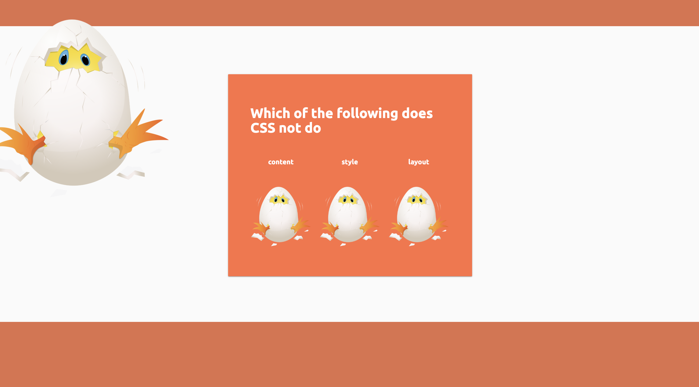

  

  
  <a href="">
    

## Introduction

You know 

 - Most children's game designed with only entertainment in mind and they can be addicting.
 - Most of the educational games are designed for learning foreign languages or math.
 - There isn't any free games out there to expose kids to learn web development.
 

Watch [this demo](https://youtu.be/O1_E55hiE0A) to learn more about the project.

## Features

- **Interactive Animations**. Intuiative for kids to learn as they level up in the game.
- **A Collection of Web Development Basics**. Simply start on landing page of the game.
- **Game ending credit**. When the player win the game, there is a creative animation at the end. 

## Example

Player landing page.

## Usage

#### Interactive Animations

There are a few highlights of interactive animations with growYourChick:
- Players can read, anwer questions when the game is started.
- The feedback of the answers are based off the growing size of the chicken.
- At the end of the game, if the player wins, the final credit will display.

#### Customization of Questions

There are a few of different pre-set questions about basic HTML and CSS. Down the roadmap, we would like to add customized questions into the system so that user can select easy, medium or hard type of questions.

##### Technologies
-  [`JavaScript`](https://developer.mozilla.org/en-US/docs/Web/JavaScript) - Front end with vanilla JavaScript
-  [`Custom CSS Styling`](https://developer.mozilla.org/en-US/docs/Web/CSS) - Front end with materilze css and custom CSS
-  [`Ruby on Rails`](https://rubyonrails.org/) - Backend

##### Plugins

- [`CSS shake`]("css shake animation") 

##### Libraries
-  [`Materialize CSS`](https://materializecss.com) - CSS materialize framework 

-  [`Google Fonts`](https://fonts.google.com) - Styling Fonts 

## FeedBack
Creating issues on Github are welcome. Also please leave feedback emails for design suggestions and more!

## Authors

growYourChick is a project by <a href="https://victoriamei.com">Victoria Mei - VickysDailyStandup</a>

- Social Media ([@DailyVickys](https://www.instagram.com/vickysdailystandup/), [@vickysdailystandup]([@DailyVickys](hhttps://twitter.com/DailyVickys)))

